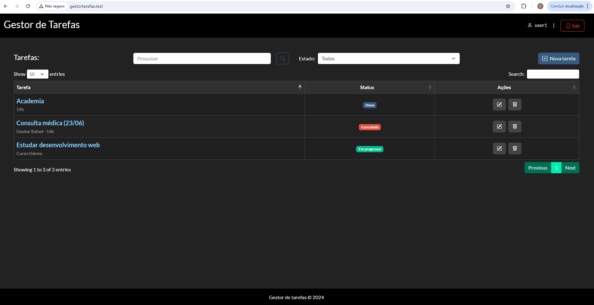

## Sobre o projeto

- Meu primeiro código utilizando laravel 10
- O projeto busca servir como um gestor de tarefas, permitindo os usuários cadastrados no banco de dados criarem e editarem suas tarefas

## Vamos testar?

- php artisan serve
- php artisan db:seed --class=UsersSeeder

## Credenciais básicas para o login

user = 'user1'

password = '1234'

